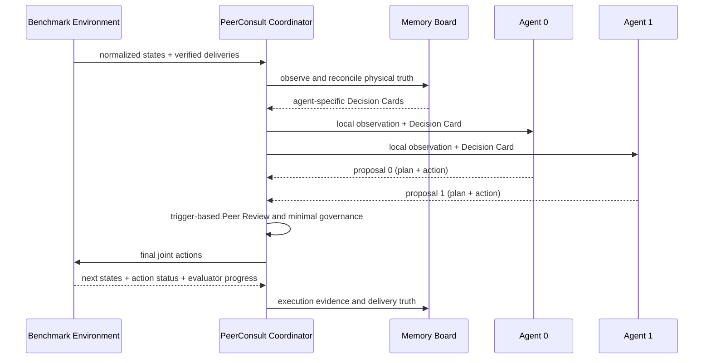

# PeerConsult V2：方法设计、TDW-MAT 实现与跨 Benchmark 移植指南

本文档面向另一个 Codex agent。目标不是逐行复制 TDW-MAT 代码，而是将当前的双智能体协作方法移植到一个交互、动作或观测接口不同的 benchmark，同时保留公平对比所需的方法边界。

## 1. 代码基准与结论先行

- 当前实现仓库：`https://github.com/Lzmlzmlzm2021/tdw-mat.git`
- 分支：`feature/tdw-peer-consult`
- 当前方法提交：`6440b5c`（`Refine PeerConsult memory and rolling coordination`）
- 方法前快照：`dbd3bc3`（`snapshot TDW-MAT before multi-agent adaptation`）
- 官方 CoELA 外层基准：`UMass-Embodied-AGI/CoELA`，本地 `origin/master` 为 `3e12dea925d735eefce33da71806ae9da6fcaf3f`

从 `dbd3bc3` 到 `6440b5c`，PeerConsult 方法本体涉及 6 个文件，约 `+1934/-5`：

| 文件 | 角色 | 是否属于方法核心 |
|---|---|---|
| `tdw-gym/peer_consult.py` | Memory Board、Decision Card、Peer Review、Action Obligation、导航恢复、真值协调 | 是，核心文件 |
| `tdw-gym/challenge.py` | 把 coordinator 插入 episode 主循环 | 是，集成入口 |
| `tdw-gym/tdw_gym.py` | 动作 ticket、底层状态、环境确认的 delivered IDs | 是，证据接口 |
| `LLM/LLM.py` | 在 prompt 中保留最新 Decision Card 和有限自然语言历史 | 是，提示接口 |
| `tests/test_peer_consult.py` | 19 个协调语义单测 | 是，移植验收参考 |
| `README.md` | 仓库说明 | 否 |

当前工作树相对官方 CoELA 还有 OpenAI/vLLM 接口、Windows 启动、Box Scout、资产缓存、结果恢复等修改。它们不是 PeerConsult 的必要组成，不应整体复制到另一个 benchmark。

可用以下命令查看纯方法差异：

```bash
git diff dbd3bc3..6440b5c -- \
  LLM/LLM.py \
  tdw-gym/challenge.py \
  tdw-gym/tdw_gym.py \
  tdw-gym/peer_consult.py \
  tests/test_peer_consult.py
```

## 2. 方法的一句话定义

PeerConsult V2 是一个放在两个独立具身 agent 之外的、集中式但只共享符号事实的双时间尺度协调层：

1. 每个 agent 保留自己的视觉、局部地图、LLM 规划器和技能执行器。
2. 协调器把双方可验证的符号状态写入 Memory Board。
3. 每次决策只向每个 LLM 提供一张短小、与该 agent 相关的 Decision Card。
4. 两个 agent 各自提出动作后，协调器只在有证据的冲突、错误或安全风险出现时进行 Peer Review 和最小修改。
5. 动作完成后，环境返回的执行状态和 evaluator 真值再写回板上，形成闭环。

它不是固定分房、固定任务合同或“必须装满容器才交付”的脚本。当前 V2 使用滚动、短期的意图与 claim；部分载荷通常保留自主决策，只有容量耗尽或帧预算风险占优时才强制交付。

## 3. 方法边界

### 3.1 保留在每个 agent 内部的内容

- RGB-D、segmentation、局部 occupancy map。
- 物体发现和本地语义记忆。
- LLM 生成候选计划。
- 导航、抓取、装容器、投放等技能执行器。
- agent 自己的自然语言对话。

### 3.2 协调层共享的内容

- 物体 ID、类别、最近位置、房间、最后观测者和时间戳。
- 双方当前物理持有物及容器内容。
- 环境确认的已交付物体。
- 当前短期 intent、object claim、room claim、恢复 cooldown。
- 动作 ticket 对应的终止状态、有效性和完成帧。
- 最近相关 review 和少量对话事件。

### 3.3 不允许作为真值的内容

- agent 在自然语言中声称“已经拿到/已经送达”。
- CoELA 本地 `satisfied` 列表。
- 仅由计划文本推断出的物理持有关系。
- 未获得底层 action terminal 的“成功”猜测。

核心原则是：agent 可以提出事实，Checker 只能接受传感器、物理状态或 evaluator 证据。

## 4. 总体调用链



TDW-MAT 中的实际顺序位于 `TDWPeerConsultCoordinator.act()`：

1. `board.observe(...)`
2. `_delivery_advisory(...)`
3. `decision_view(...)` 和 `_inject_public_board(...)`
4. `_force_obligation_plan(...)`
5. 两个 `agent.act(...)`
6. `_intent_from_plan(...)`
7. `_review_and_govern(...)`
8. 写入 `peer_consult.jsonl`
9. 环境 `step(actions)`
10. `observe_outcome(...)`

## 5. Memory Board：完整证据层

实现：`tdw-gym/peer_consult.py::TDWSharedBlackboard`。

主要字段：

| 字段 | 含义 | 更新/遗忘规则 |
|---|---|---|
| `goal_ledger` | required、delivered、remaining | delivered 只接受 evaluator 的 object-id 映射 |
| `known_entities` | 历史见过的目标、容器、终点 | 保留完整符号档案；不全部送入 prompt |
| `physical_owners` | 当前手持/容器内的物理归属 | 每次 observe 清空后从当前状态重建 |
| `container_contents` | 容器 ID 到内容 ID | 每次 observe 从物理状态重建 |
| `claims` | 短期物体占用 | 450 TDW frames TTL；换目标或已交付时释放 |
| `room_claims` | 短期房间意向 | 450 TDW frames TTL；不是长期分房合同 |
| `target_cooldowns` | 失败目标的恢复冷却 | 到期自动删除 |
| `current_intents` | 两个 agent 当前语义阶段 | 每个 coordinator step 重写 |
| `obligations` | 持有有效载荷时的交付责任 | 物理载荷存在则持续；载荷消失则删除 |
| `execution_evidence` | action ticket 的终止证据 | 相同 `(agent, action_id)` 只记录一次 |
| `dialogue_events` | agent 自然语言事件 | 完整归档；Decision Card 只取最近相关部分 |
| `reviews` | 被否决/修订的提案 | 完整日志；prompt 只取少量相关项 |

`observe()` 同时完成四件关键工作：

1. 融合当前可见物体与 agent 已有的 `object_per_room` 符号记忆。
2. 从真实 held state 重建 ownership 和 container contents。
3. 用 action ticket 记录一次性执行证据并维护连续失败计数。
4. 只用环境的 `delivered_objects` 更新目标账本。

## 6. Decision Card：有界工作记忆

实现：`TDWSharedBlackboard.decision_view()` 和 `prompt_summary()`。

Memory Board 可以持续积累，但 LLM 每次只收到 agent-specific Decision Card：

- 当前帧和剩余帧预算。
- 已交付总量及按类别统计的剩余目标。
- 自己的房间、载荷、载荷年龄和连续失败数。
- 队友的房间、载荷和当前 intent。
- delivery advisory。
- 最多 5 个可行动目标，按同房间、距离、新鲜度排序。
- 最多 4 个房间摘要。
- 对方 active claims。
- 最近 2 个与自己有关的 review。
- 最近 4 条 agent-authored 对话。

`LLM/LLM.py::run()` 在发现 `[Memory Board]` 时，只保留最近 6 条自然语言对话和最新一张 board；没有 board 时维持原 CoELA 的最近 3 条行为。`_inject_public_board()` 会先删除旧 board，再加入新 board，并把原始对话档案限制在最近 14 项。

这解决了两类问题：

- board 变长导致 prompt 中关键信息被稀释。
- 原 CoELA 只留 3 条 dialogue，导致未解决请求过早消失。

移植时不要把完整 `known_entities`、全部历史 review 或 action trace 直接塞给 LLM。若目标 benchmark 希望用 LLM 做摘要，应让摘要器只决定“哪些事实相关”，不能让它改写 evaluator、ownership 或 action status。

## 7. Intent、Claim 与滚动协作

实现：`_intent_from_plan()`、`claim()`、`release_stale_agent_claims()` 和 `claim_room()`。

当前 CoELA 计划被映射为：

| CoELA plan | intent stage |
|---|---|
| `go grasp ...` | `acquire` |
| `put ...` | `load_container` |
| `transport ...` | `deliver` |
| `go to ...` / `explore ...` | `explore` |
| `send a message ...` | `communicate` |
| `None` | `idle` |

低层动作处于 `ongoing` 时，仍保留原计划的语义 stage 和 target。否则 agent 在导航途中会被错误视为 `continue/idle`，claim 也会过早消失。

Claim 的用途只是在短时间内防止双方追同一个物体。Room claim 只在同房间不足以提供两个不同有效目标时生效；如果房间里有足够多的不同目标，允许双方同房行动。这是滚动协调，不是预先把整个 episode 分成互斥房间。

## 8. Peer Review：有触发器的最小修改

实现：`TDWPeerConsultCoordinator._review_and_govern()`。

当前 review 是确定性的安全/一致性层，不会无条件调用第三个 LLM。只有以下触发器会修改提案：

| trigger | 条件 | 处理 |
|---|---|---|
| `duplicate_claim` | 两个 agent 同时追同一 object ID | 保留已有 claim 或低 ID agent，另一个 replan |
| `claim_conflict` | 目标已被队友 claim | 拒绝当前计划 |
| `ownership` | 目标已被队友物理持有 | 拒绝当前计划 |
| `verified_fact` | 目标已由 evaluator 确认交付 | 拒绝当前计划 |
| `goal_quota` | 某类别剩余配额已被载荷/更近提案覆盖 | 给出不同类别的候选目标 |
| `room_assignment` | 同房间没有足够的不同有效目标 | 给失败方短期替代房间 |
| `obligation` | 满载或 deadline 风险使交付占优 | 拒绝额外抓取 |
| `navigation_recovery` | 长时间无空间进展或连续失败 | 清计划、冷却旧目标、换目标 |
| `recovery_cooldown` | 再次追仍在冷却的失败目标 | 换本地替代目标 |
| `message_reconciliation` | 对话与 ownership/容器能力冲突 | 用 grounded message 替换 |
| `spatial_conflict` | 两个 agent 过近且同时向前 | 暂时串行化其中一个动作 |

`_deny()` 有两条重要保护：

- 不覆盖已经 `ongoing` 的底层动作。
- 一个 agent 在同一 coordinator step 最多被改写一次。

移植到新 benchmark 时，应保留“有证据才触发、最小修改、ongoing 不打断”三个性质。替代动作必须由 benchmark adapter 提供；TDW-MAT 当前用原地转向作为安全 replan 动作，这不是通用设计。

## 9. Action Obligation 与交付决策

实现：`_delivery_advisory()` 和 `_force_obligation_plan()`。

当前 V2 不再使用“未装满就绝不交付”的硬规则。流程是：

1. 如果一只手拿目标、另一只手拿尚有容量的容器，先强制 `put_in`，避免手持目标和容器长期分离。
2. 如果物理载荷已满并且终点已知，强制交付。
3. 如果只部分装载，默认仍由 LLM 决定继续收集还是交付。
4. 只有剩余帧预算不足以安全完成交付时，部分载荷才被强制交付。

Delivery Card 当前计算：

```text
estimated_delivery_frames = 150 + 32 * bed_distance_m
                            + 45 * consecutive_failures
force_delivery = remaining_frames
                 <= estimated_delivery_frames + 180
```

此外，当载荷年龄达到 420 帧且附近没有有效目标，或剩余预算进入较宽的风险区间时，只给 `prefer_delivery` 建议，不直接覆盖计划。

这些数值都与 TDW 的帧率、房屋尺度、技能延迟和 3000 帧上限有关。移植时必须用目标 benchmark 的动作时长/路径长度重新标定，不能照抄。

## 10. 导航恢复

实现：`_govern_navigation()`。

TDW-MAT 当前规则：

- 追踪 `(agent, semantic plan, anchor position, anchor frame)`。
- 移动至少 `0.75 m` 就更新 anchor。
- 同一导航计划 `120 frames` 没有足够位移，或连续底层失败达到 3 次，触发恢复。
- 对失败目标设置 `360 frames` cooldown。
- 清除 agent 的 `plan` 和缓存的 `target_pos`，优先选择仍需要、未持有、未 claim、非 cooldown 的同房间/近距离目标。

这里的关键不是阈值，而是“语义计划 + 物理位移 + action terminal evidence”的三者联合。新 benchmark 如果只有离散网格，改用 cell distance 或 shortest-path distance；如果是异步技能，使用 wall-clock/action tick 而不是环境 frame。

## 11. Checker Reconciliation 与终止

当前实现有两层 reconciliation：

1. **状态 reconciliation**：`physical_owners` 每步从 held state 重建，`goal_ledger` 只接受 evaluator-confirmed deliveries；本地 `satisfied` 或消息不改变真值。
2. **消息 reconciliation**：若 agent 声称了错误持有关系，或要求不支持的容器嵌套，type-6 消息会被替换为由板上事实生成的 grounded update。

TDW-MAT 没有给 PeerConsult 单独增加一个全局 terminate 动作。episode 的 `done` 和 `check_goal()` 仍由环境决定，`finalize()` 只记录最终账本与 evaluator progress。若目标 benchmark 有显式 `STOP/DONE` 动作，应只有在 evaluator/goal checker 证据支持时才允许发出；不要让自然语言共识直接终止任务。

## 12. TDW-MAT 为方法新增的底层证据接口

实现：`tdw-gym/tdw_gym.py`。

每个 agent observation 增加：

```text
action_id
action_type
action_status
action_status_code
action_started_frame
action_completed_frame
action_buffer_length
action_terminal
valid
current_frames
```

`action_id` 在每个新高层动作开始时递增。Coordinator 只在 `action_terminal=True` 且该 `(agent_id, action_id)` 尚未见过时写入 execution evidence，从而避免同一失败在多个 observation 中重复计数。

环境还提供：

```python
get_delivered_objects() -> dict[int, str]
```

其返回值来自 `check_goal()` 对真实 object transform 和 goal region 的判断，而不是 agent 内部状态。

新 benchmark 至少要暴露等价的：唯一 action ticket、terminal/ongoing、success/failure/invalid、完成时间，以及 evaluator-confirmed goal delta。如果无法得到 object-level delivered IDs，应提供单调的、可审计的目标完成事件；仅有一个总分时，类别配额 reconciliation 会变弱。

## 13. 当前代码对 agent 的隐式依赖

`TDWPeerConsultCoordinator` 目前直接读取或修改 CoELA agent 的以下内容：

```text
method: act(state)
mutable: plan, target_pos, dialogue_history, fix_lm_satisfied
state: current_room, rooms_name, rooms_explored
memory: object_list, object_per_room
```

移植时建议不要继续直接访问新 agent 的内部字段，而是实现一个 `AgentAdapter`：

```python
class AgentAdapter:
    def propose(self, snapshot, decision_card): ...
    def current_semantic_plan(self): ...
    def clear_cached_plan(self): ...
    def set_short_horizon_plan(self, plan): ...
    def known_entities(self): ...
    def current_room(self): ...
```

同时实现环境归一化接口：

```python
class BenchmarkAdapter:
    def normalize_state(self, raw_state) -> AgentSnapshot: ...
    def verified_deliveries(self) -> dict: ...
    def goal_progress(self) -> tuple: ...
    def safe_replan_action(self, agent_id) -> dict: ...
    def parse_intent(self, agent_id, proposal) -> Intent: ...
```

建议的 `AgentSnapshot` 最小字段：

```text
frame/tick
pose or topological location
current room/region
visible symbolic entities
held entities and nested contents
received messages
action ticket, status, terminal, valid
```

## 14. TDW-MAT 特有编码，必须替换

以下内容是适配细节，不是方法定义：

- 终点固定叫 `bed`，且通过 Bedroom 中 3 米范围判断交付。
- 两只手、容器容量 3。
- 计划是字符串，并用 `(...)` 中的数字解析 target/room ID。
- 动作 `0/1/2/3/4/5/6/8` 分别表示前进、转向、抓取、装入、投放、消息、等待等 TDW 原语。
- review 拒绝后用 agent 0 左转、agent 1 右转作为安全替代动作。
- 房间名形如 `<Kitchen> (1000)`。
- agent 名字固定为 Alice/Bob，且 coordinator 写死两个 agent。
- 距离单位为米，预算单位为 TDW physics frames。
- `_message_needs_reconciliation()` 目前依赖英文正则和物体 ID 写法。
- 两个并发前进动作在距离小于 `1.25 m` 时被串行化。

目标 benchmark 应使用结构化 proposal/intent，尽量不要再次依赖自然语言 plan 的字符串解析。

## 15. 不应随方法一起移植的改动

- `transport_challenge_multi_agent/asset_cached_controller.py` 的资产缓存。
- `transport_challenge_multi_agent/transport_challenge.py` 的本地 TDW build/版本兼容。
- Box Scout、Human+Box prompt 和能力 guard，除非目标任务也有异构 embodiment。
- Windows 端口清理和进程启动逻辑。
- `eval_artifacts.py` 的断点续跑协议，除非目标 benchmark 需要相同的结果防覆盖机制。
- OpenAI/vLLM/Qwen API 重试与 `TDW_MAT_FIX_LM_COMMUNICATION`。这是模型服务兼容，不是协作机制。
- `agent_memory.py` 的性能优化，除非新 benchmark 复用同一地图模块。

但有一个语义修正必须保留其效果：看到队友拿着目标不能等价为“已交付”。当前 `lm_agent.py` 的 `fix_lm_satisfied` 修复了这个问题，Coordinator 初始化时会强制开启。新 benchmark 即使没有该变量，也必须实现同样的状态分离。

## 16. 推荐移植步骤

### 第一步：只做接口审计

找到目标 benchmark 的：episode 主循环、agent `act/plan` 入口、观测 schema、动作 schema、持有状态、容器状态、底层 action status、goal checker 和终止条件。先画出从 LLM plan 到 simulator action 的完整调用链，不修改算法。

### 第二步：建立 normalization adapter

把目标环境状态转换为本文第 13 节的 `AgentSnapshot`。先确保 object ID、ownership、container contents、action terminal 和 evaluator deliveries 都可重复验证。

### 第三步：移植纯状态层

先移植 `TDWGoalLedger` 和 `TDWSharedBlackboard`，去掉 TDW 字符串、bed、动作 type 等依赖。为每个事实写来源和时间戳。

### 第四步：接入 Decision Card，但不做 action override

只把 compact card 注入两个 agent，记录 proposal 和结果。用单 episode 验证 prompt 长度、有界历史和原方法行为是否仍能运行。

### 第五步：按风险由低到高启用治理

建议顺序：

1. evaluator delivery truth 和 ownership reconciliation。
2. duplicate object claim。
3. goal type quota。
4. stale claim/cooldown。
5. message reconciliation。
6. navigation recovery。
7. delivery advisory 与强制 obligation。
8. 空间冲突串行化。

每增加一项都运行独立消融，不要一次打开全部规则后只看总分。

### 第六步：接入 outcome 闭环与 JSONL

每个决策至少记录：输入 card、两个原始 proposal、触发的 review、最终动作、action ticket、terminal status、verified goal delta。日志格式可参考 `peer_consult.jsonl`。

### 第七步：单集双 agent 跑通，再做批量实验

先选择一个对象少、终点已知、原方法能稳定完成的 episode，验证完整闭环；随后再测试低分 episode 和完整数据集。

## 17. 最小验收测试

目标 benchmark 的移植至少应覆盖：

1. 容器内对象的 physical owner 正确指向 carrier/container。
2. 双方追同一个 object ID 时，只有一方保留计划。
3. ongoing 动作绝不被 review 覆盖。
4. 满载时触发交付。
5. 部分载荷且预算充足时不被强制交付。
6. 部分载荷但 deadline 风险占优时触发交付。
7. 手持目标和空余容器先触发 pack/load。
8. 同房间有不同有效目标时允许双方并行。
9. 目标类别剩余配额会扣除双方物理载荷。
10. 无导航进展会清缓存计划并冷却旧目标。
11. action ticket 在多个 observation 中只产生一次 evidence。
12. agent 自报 `satisfied` 不更新 evaluator ledger。
13. 错误 ownership 消息被 grounded message 替换。
14. Decision Card 的目标、房间、对话和 review 数量有硬上限。
15. 关闭 PeerConsult 后，原 benchmark 的 agent、prompt、动作和指标协议不变。

TDW-MAT 对应单测位于 `tests/test_peer_consult.py`，当前共有 19 个语义测试，可直接作为移植测试模板。

## 18. 公平对比要求

为了证明收益来自协作机制，而不是底层能力变化，新旧方法对比应固定：

- 完全相同的两个 agent embodiment。
- 相同 LLM、采样参数、prompt 基础模板和模型服务。
- 相同 perception/GT mask 设置。
- 相同低层导航、抓取、装载和投放技能。
- 相同 episode 列表、seed、frame/tick 上限和 evaluator。
- 相同通信解析兼容选项。
- 相同断点续跑与结果校验协议。

PeerConsult 允许新增的是：共享符号板、prompt 中的有界 Decision Card、proposal review、真值 reconciliation 和基于已有底层反馈的恢复决策。若为了暴露 action terminal 或 evaluator delivery 而修改环境接口，该修改必须同时供新旧方法使用，但旧方法不应使用额外协调逻辑。

## 19. 建议消融

至少报告：

```text
Original collaboration
+ Decision Card only
+ object/goal reconciliation
+ claim and quota review
+ navigation recovery
+ delivery advisory/obligation
Full PeerConsult V2
```

除总 transportation rate 外，建议同时统计：重复目标冲突、重复导航/抓取、无交付帧区间、容器利用率、部分载荷交付率、消息次数/陈旧度、claim 与物理持有不一致、action failure、recovery 触发后成功率，以及 episode 结束时剩余物体类型。

## 20. 当前实现的已知限制

- Coordinator 只支持两个 agent。
- Peer Review 当前是确定性规则层，“reviewer=peer”是协议语义，不代表额外调用 peer LLM 生成判决。
- `known_entities` 完整档案没有长期删除策略；prompt 有界，但超长 episode 的内存仍可能增长。
- 英文消息 reconciliation 是启发式正则，不是通用事实解析器。
- Delivery cost 是 TDW 手工估计式，需要 benchmark-specific 标定。
- 直接修改 `agent.plan/target_pos` 与 CoELA 耦合较强；新实现应通过 adapter。
- 当前 `goal_ledger.complete()` 可计算全局完成，但 TDW 的最终终止仍由环境 `done` 决定。

## 21. 给接手 Codex 的执行提示

先不要复制整个 TDW-MAT 工作树。优先阅读：

1. `tdw-gym/peer_consult.py`
2. `tests/test_peer_consult.py`
3. `tdw-gym/challenge.py::Challenge.submit`
4. `tdw-gym/tdw_gym.py::get_delivered_objects`、`get_obs`、`step`
5. `LLM/LLM.py::run`
6. `tdw-gym/lm_agent.py` 中 `fix_lm_satisfied` 的语义

随后在目标 benchmark 中先提交一份“接口映射表”，说明每个 `AgentSnapshot`、intent、action ticket、delivery truth 和安全替代动作来自哪里。只有这些映射被验证后，再接入治理规则。这样可以避免把 benchmark 交互 bug 误判为 LLM 或协作机制问题。
