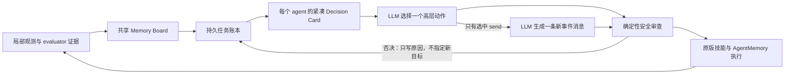

# PeerConsult V3.3：稳定任务、按需通信与闭环交付

## 1. 目标与诊断依据

V3.3 针对 V2/V3/V3.1/V3.2 轨迹中反复出现的四类问题：

1. **目标震荡**：CoELA 只有一个易失的 `agent.plan`；去房间途中只要发现任意新物体，就会清空计划。V3 的冲突、配额和恢复逻辑又会直接写入一个替代计划，形成频繁往返。
2. **无效通信**：旧流程每次重规划都先生成消息，再让 planner 决定是否发送。即使 planner 最终选择物理动作，也已经消耗一次模型调用；相同事件还会产生大量近义复述。
3. **窄轨迹探索**：原版 `goexplore()` 只前往房间中心并原地旋转，空间覆盖不足，可能在已进入房间的情况下漏掉边缘目标。
4. **放下与得分脱节**：V3.2 在 Bedroom 内距离床 2.5 m 时直接覆盖为 `type=5`。物理放下成功不等于 evaluator 计分，导致重复放下、重抓而 TR 不增加；末段预算规则还误把容器当成目标物体拒绝。

V3.3 的原则是：**代码维护事实、约束和未完成任务；LLM 选择高层任务；原版 AgentMemory 继续负责路径和运动。**

## 2. 协作机制总览

### 2.1 持久任务账本

任务不再等同于当前 `agent.plan`。Memory Board 为每个已知实体和房间维护任务：

- `deliver_goal_object`：找到、抓取并最终由 evaluator 确认交付的目标物体；
- `container_resource`：可选运输资源，不计入目标配额；
- `explore_room`：尚未完成空间覆盖的房间；
- `deliver_payload`：某个 agent 当前携带有效载荷时生成的高优先级任务。

状态包括：

- `pending`：可选择；
- `in_progress`：当前计划正在执行；
- `suspended`：planner 切换了计划，但原任务仍未完成；
- `blocked`：冲突、超额、无进展或预算不足，带有限期冷却；
- `carried` / `in_use`：由物理持有证据确认；
- `completed`：只由覆盖证据或 evaluator 交付证据确认；
- `surplus`：该物体类别的目标配额已满足。

关键不变量：

- 发消息、单步避让和临时恢复不会删除 active task；
- 被否决的提案进入 `blocked`，治理代码不再直接挑一个替代目标；
- 新目标证据进入账本，但不会中断正在进行的房间转移；
- `suspended` 的目标任务在盲目探索之前恢复；
- 目标交付只有 evaluator 的 object-id 映射能够标记为 `completed`。

### 2.2 稳定的 LLM 调度

Decision Card 新增：

- `active_task`；
- 按 active、suspended、是否 blocked、任务优先级和距离排序的 `task_queue`；
- `actionable_targets`、`actionable_containers`、房间覆盖和交付风险。

当本地已有未阻塞、可执行的目标任务时，候选动作中不再同时提供无目的 `go to room` 和 `explore room`。LLM 仍可在以下动作间决策：

- 选择哪个已知目标；
- 是否拿附近有收益的容器；
- 是否装箱；
- 是否交付当前载荷；
- 有新通信事件时是否发消息。

代码仍可否决：重复 claim、已交付物体、被同伴持有、目标类别超额、无进展、末段无法完成的目标抓取。V3.3 的否决只写回任务状态和原因，下一次选择由 LLM 完成。

### 2.3 先决定是否通信，再生成内容

V3.1 的物理事件门控继续保留：`new_target_evidence`、`new_container_evidence`、`payload_change`、`delivery_progress`、`recovery_request`、`delivery_priority`；冷却为 240 帧，重复窗口为 720 帧。

V3.3 改成两阶段：

1. 代码只在新事件存在时向 planner 提供抽象候选 `send a message`；
2. planner 与物理动作一起决定是否选择该候选；
3. 只有选择了 `send a message`，才调用消息生成 prompt；
4. prompt 要求只针对这次新事件生成一句能改变同伴下一动作的信息，不复述目的地、巡逻状态或已报告的容器意图；
5. 空消息、能力违规消息会被 guard 拒绝，并由 LLM 在无消息候选的动作集合上重新选择一次。

因此，事件门控只决定“现在是否值得让 LLM 考虑通信”，最终是否发送仍由 agent 的 LLM 决定。

### 2.4 覆盖式探索

原版 `gotoroom()`、`goexplore()` 和 AgentMemory 路径算法保持不变，以便旧协议复现和导航一致性测试。

V3.3 新增高层包装器：

- `gotoroom_v33()`：去房间途中发现新物体时继续完成当前转移，新证据留到下一决策边界；
- `goexplore_v33()`：从 TDW scene region 取得房间中心和四个内缩采样点，按当前位置做最近邻排序；
- 每个空间采样点执行少量转向观测，再进入下一个点；全部采样完成才把房间记为 `all`。

这些采样点只定义高层探索目标，所有实际路径仍由原版 `AgentMemory.move_to_pos()` 生成。

### 2.5 类型正确的末段预算

V3.3 保留“预计抓取加交付已经来不及时拒绝新目标”的思想，但只适用于 `entity.type == 0` 的目标物体。

- 容器是 `container_resource`，不再被 `late_acquisition` 当成目标物体拒绝；
- 若 agent 已携带有效载荷，交付优先级仍可让高层计划切换到标准 transport skill；
- 被预算否决的目标进入有限期 blocked 状态，不由代码强行换成另一个目标。

### 2.6 evaluator 闭环的安全交付

V3.3 保留 V3.2 的权威 `satisfied` 对齐，但取消 2.5 m 内的代码强制 `type=5`：

- 只有原版 `goput()` 到达 1.5 m 接近阈值后才能提交放下动作；
- 放下前记录 agent 实际携带的目标 object IDs；
- 动作结束后逐 ID 查询 evaluator 已交付映射；
- 已计分物体完成任务；未计分物体回到高优先级 pending，并记录 `delivery_confirmation` 与失败次数；
- 后续由 planner 选择恢复、重新接近和标准交付，而不是在宽松半径内重复盲放。

## 3. 代码改动位置

### `tdw-gym/peer_consult.py`

- 新增 `PROTOCOL_V33`；
- `TDWSharedBlackboard` 新增 `tasks`、`active_tasks`、`task_history`；
- 新增任务刷新、intent 绑定、阻塞与 agent-specific task queue；
- V3.3 使用稀疏通信和 evaluator 权威交付记账；
- 安全审查不再直接赋替代目标/房间；
- 空间冲突只暂停一个物理步，不清空任务；
- 末段规则区分目标与容器；
- 新增放下尝试与 evaluator 得分核对。

### `LLM/LLM.py`

- `get_available_plans()` 支持抽象 `send a message` 候选；
- 依据 task queue 过滤 blocked/冲突目标；
- 有本地目标任务时去除盲目房间探索候选；
- `run()` 改成 planner 先选择、消息后生成；
- 加入 V3.3 稳定任务与非重复通信 prompt；
- 修复 fuzzy parse 默认跳过第一个物理候选的问题。

### `tdw-gym/lm_agent.py`

- 原版导航方法保持原始 AST；
- 新增 `gotoroom_v33()` 与 `goexplore_v33()` 高层包装；
- V3.3 dispatch 使用新包装，旧协议继续使用原版方法。

### `tdw-gym/tdw_gym.py`

- env API 新增 `room_waypoints()`，从 scene region 产生中心和四个内缩覆盖点。

### `tdw-gym/challenge.py` 与 `tdw_mat_setup/run_eval_qwen.ps1`

- CLI/启动 helper 接受 `PeerConsultV3.3`；
- 本次修改没有启动远程实验，也没有向计算节点写入任何数据。

### `tests/`

V3.3 新增回归覆盖：

- 被切换的任务进入 suspended；
- review 不硬编码替代目标；
- 容器不受 target-only 末段规则影响；
- 不触发 V3.2 直接放下；
- 未得分放下重新进入任务队列；
- 物理选择不调用消息生成器；
- 只有选中消息才生成内容；
- 有可执行目标时不提供盲目探索候选；
- 原版导航方法 AST 保持一致。

## 4. 日志与实验验收指标

完整实验应至少比较 V2、V3.1、V3.2、V3.3 的：

1. TR 和逐 episode TR；
2. `task_history` 中每 1000 帧任务切换数、suspended 恢复率、blocked 原因；
3. 相同 target/room 在 120 帧内的快速返回次数；
4. planner 调用数、消息选择数、消息生成调用数、`type=6` 数和近重复数；
5. 每个房间的覆盖采样完成率、目标首次发现帧；
6. 抓取、装箱、标准放下、evaluator 确认交付数；
7. `delivery_confirmation` 中未计分放下比例及同一物体重复失败数；
8. 首次交付帧、携带有效载荷但未交付的持续帧数；
9. 3000 帧结束时：已知未抓目标、仍携带载荷、未覆盖房间。

建议先跑 E6/E8/E10/E12/E14 回退集。只有 V3.3 至少恢复 V3.1 的 33/50、显著减少目标快速返回与近重复消息，并且未计分放下不再形成循环，才启动完整 24 episode。

## 5. 当前验证状态

- Python 语法检查：通过；
- PowerShell 启动脚本解析：通过；
- 本地单元测试：72/72 通过；
- 远程/TDW episode 评测：尚未启动，不能把单元测试结果解释为 TR 提升。
